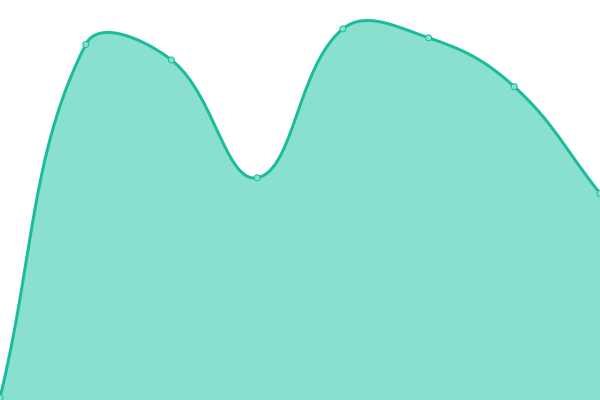
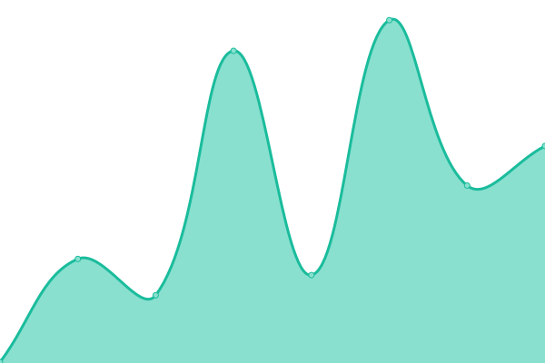

# [📈 Live Status](https://dwiperdana.github.io/upptime): <!--live status--> **🟧 Partial outage**

This repository contains the open-source uptime monitor and status page for [Aditia Dwiperdana](http://dwiperdana.com), powered by [Upptime](https://github.com/upptime/upptime).

With [Upptime](https://upptime.js.org), you can get your own unlimited and free uptime monitor and status page, powered entirely by a GitHub repository. We use [Issues](https://github.com/dwiperdana/upptime/issues) as incident reports, [Actions](https://github.com/dwiperdana/upptime/actions) as uptime monitors, and [Pages](https://dwiperdana.github.io/upptime) for the status page.

<!--start: status pages-->
<!-- This summary is generated by Upptime (https://github.com/upptime/upptime) -->
<!-- Do not edit this manually, your changes will be overwritten -->
<!-- prettier-ignore -->
| URL | Status | History | Response Time | Uptime |
| --- | ------ | ------- | ------------- | ------ |
|  [Agate](https://agate.id) | 🟩 Up | [agate.yml](https://github.com/dwiperdana/upptime/commits/HEAD/history/agate.yml) | 

 2489ms
     
 | 

<a href="https://dwiperdana.github.io/upptime/history/agate">100.00%</a>
    

|  [Personal Website](https://dwiperdana.com) | 🟩 Up | [personal-website.yml](https://github.com/dwiperdana/upptime/commits/HEAD/history/personal-website.yml) | 

 890ms
     
 | 

<a href="https://dwiperdana.github.io/upptime/history/personal-website">100.00%</a>
    

|  [Game Dev dan Sekitarnya](https://forum.dwiperdana.com) | 🟥 Down | [game-dev-dan-sekitarnya.yml](https://github.com/dwiperdana/upptime/commits/HEAD/history/game-dev-dan-sekitarnya.yml) | 

 0ms
     
 | 

<a href="https://dwiperdana.github.io/upptime/history/game-dev-dan-sekitarnya">100.00%</a>
    

|  [IGSI](https://game.indigo.id) | 🟩 Up | [igsi.yml](https://github.com/dwiperdana/upptime/commits/HEAD/history/igsi.yml) | 

 3509ms
     
 | 

<a href="https://dwiperdana.github.io/upptime/history/igsi">100.00%</a>
    

|  [DiLO Game Academy](https://academy.dilo.id) | 🟥 Down | [di-lo-game-academy.yml](https://github.com/dwiperdana/upptime/commits/HEAD/history/di-lo-game-academy.yml) | 

 0ms
     
 | 

<a href="https://dwiperdana.github.io/upptime/history/di-lo-game-academy">0.00%</a>
    

<!--end: status pages-->

[**Visit our status website →**](https://dwiperdana.github.io/upptime)

## 📄 License

- Powered by: [Upptime](https://github.com/upptime/upptime)
- Code: [MIT](./LICENSE) © [Aditia Dwiperdana](http://dwiperdana.com)
- Data in the `./history` directory: [Open Database License](https://opendatacommons.org/licenses/odbl/1-0/)
